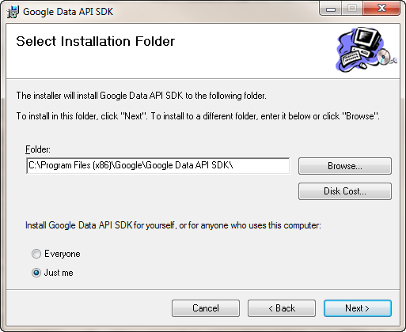
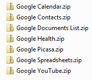
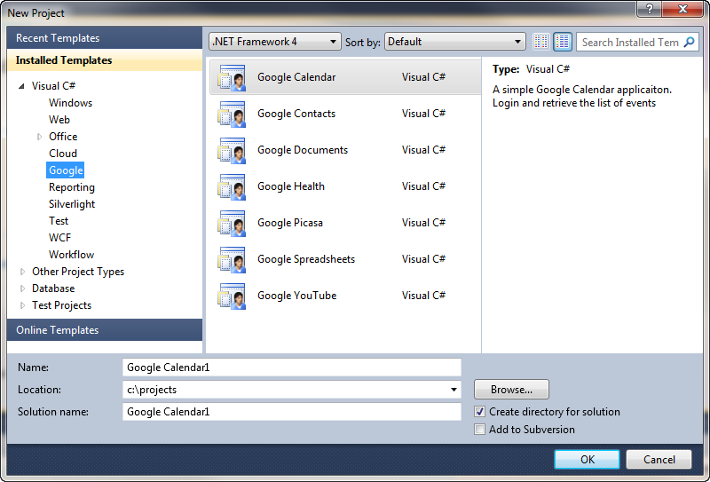
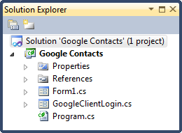
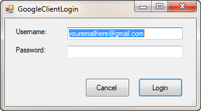
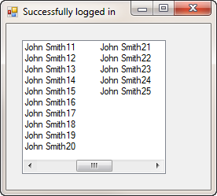
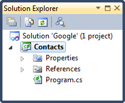
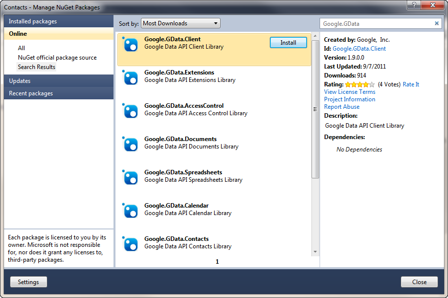

# Google Data API (GData)

## Introduction

Yesterday on [StackOverflow](http://stackoverflow.com/questions/7360736/c-google-gdata-client-read-email) I came across a question about using the Google Data API (also called GData) in .NET. Questions about it regularly pop up. Retrieving my Google data in .NET somehow seems appealing to me, but maybe that's just me. I never worked with it before, so I took some time to experiment with it a bit. Figured I'd better write it down, before I forget it again. This article is a quick introduction on using the Google Data API with the .NET Framework...so, let's get started...

## Google Data .NET Client Library

Google offers [official client libraries](http://code.google.com/apis/gdata/faq.html#clientlibs) for GData for several programming languages such as Java, .NET, Phyton and Objective-C (they even have a partial library for JavaScript). So the first thing you have to do, is to download the .NET client library from code.google.com.

You can download the .NET client library (+/- 27.7 Mb) here:

[http://code.google.com/p/google-gdata/](http://code.google.com/p/google-gdata/)

At the time of writing the most recent version is 1.9.0.0. Under the downloads section just select the MSI installation wizard package. Installing the SDK is really simple. Just click next three times and close once and you're done.



 **Tip**: Instead of installing the MSI install [NuGet](http://www.nuget.org) instead and add a reference to the Google Data API packages. Google Inc. was kind enough to make them available as NuGet packages. Each assembly of the Google Data Client library has been put in a seperate package. [You can view a list of these packages here](http://www.nuget.org/List/Search?searchTerm=author%3A%20Google%2C%20Inc.).

**Remark**: If you don't install the MSI you won't get the Visual Studio project templates that come with it. The next two parts of this text discuss these templates, so if you want to follow along, it is best to download and install the MSI. You can always switch to the NuGet packages later.

## Project Templates

Before you rush off and start Visual Studio 2010 you need to fix a small thing. Open Windows Explorer and navigate to the "My Documents" library and open the Visual Studio 2008 project templates folder. In this folder you'll notice a new folder called "Google", if you open it you'll notice it contains seven new project templates.

My Documents > Visual Studio 2008 > Templates > ProjectTemplates > Visual C# > Google



Now you need to copy the Google folder over to the Visual Studio 2010 project templates folder (My Documents > Visual Studio 2008 > Templates > ProjectTemplates > Visual C# &gt).

If you start Visual Studio 2010 now and create a new project you'll notice that it contains the new Google project templates.



## Google Project Template

Let's play around with one of the Google project templates. Create a new project and select the Google Contacts project template. Let's be \*original\* and call it "Google Contacts".

Most of the Google project templates contain the same structure. It's a simple Windows Forms application that contains two forms. A login form and another one that displays the data (contacts, calender, photos...) you are querying.



If you start the application it will ask you to enter your Google account details.



After logging in it will display a simple form that lists the first 25 people found in your contacts list.



**Remark**: I replaced the actual names in my contacts list for this demo. I don't really know that many people named "John Smith".

Feel free to explore the other Google Project Templates. They are all very similar.

## Using The Client Library

Querying data with the Google Data API usually consists out of three steps:

1. Setup a connection with the API (Google.GData.Client.Service)
2. Query the API (Google.GData.Contacts.ContactsQuery)
3. Iterate the returned data feed (Google.GData.Contacts.ContactsFeed)

Let's demonstrate how this is done by building a small console application that downloads the contacts just like Google's own project template does.

Start up Visual Studio 2010, create a new blank solution called Google and add a new console application project called Contacts.



Add a reference to the following assemblies provided by the Google Data .NET Client library:

- Google.GData.Client.dll
- Google.GData.Contacts.dll
- Google.GData.Extensions.dll

Or use NuGet to add a reference to the packages that contain these assemblies. The packages are named the same as the assemblies so you can't miss them.



First create a new service instance and give it a name (doesn't really matter how you name it).

```csharp
Service service = new ContactsService("My Contacts Application");
```

Then you must request an authentication token.

```csharp
service.setUserCredentials("your_email_address_here@gmail.com", "yourpassword");
var token = service.QueryClientLoginToken();
service.SetAuthenticationToken(token);
```

After you're authenticated you can compose a query to request the contact data.

```csharp
var uri = ContactsQuery.CreateContactsUri("your_email_address_here@gmail.com");
var query = new ContactsQuery(uri);
```

Now you are ready to request the data.

```csharp
ContactsFeed feed = (ContactsFeed) service.Query(query);
foreach(ContactEntry contact in feed.Entries)
{
    Console.WriteLine(contact.Title.Text);
}
```

The previous code sample requests the first 25 contacts and writes their names to the console output. The Google Data API automatically chunks your data into several pieces. Just check the feed's NextChunk property to check if there is more data available. If there is, you can create and execute a new query to retrieve the next chunk of data.

```csharp
if (!String.IsNullOrEmpty(feed.NextChunk))
{
    query = new ContactsQuery(feed.NextChunk);
    feed = (ContactsFeed) service.Query(query);
}
```

Voila, you can now download your Google contact data. If you don't want to copy/paste these code samples you can always download the source code from the download page. Just alter the code to make sure valid credentials are used.

That wraps it up. If you want to further explore the Google Data .NET Client library be sure to check out the help file (\*.chm) which is installed if you use the MSI installation wizard. It contains information on all of the classes, members, constructors, properties...etc. that are available in the SDK.

Reference docs about the .NET client library are also available online. You can find them here:

[http://google-gdata.googlecode.com/svn/docs/Index.html](http://google-gdata.googlecode.com/svn/docs/Index.html)
